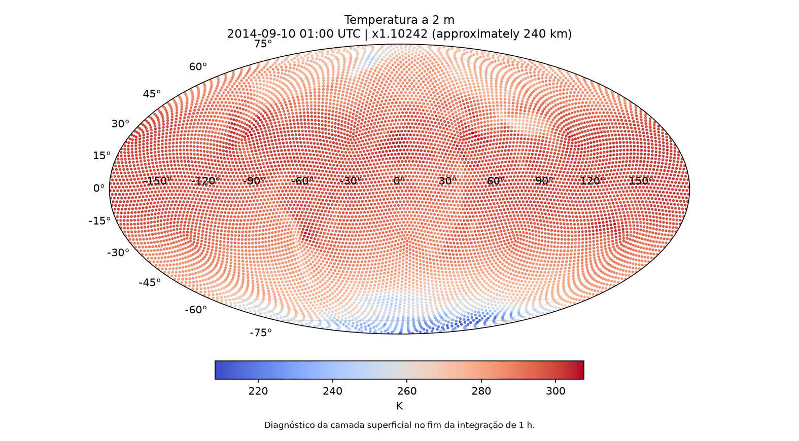
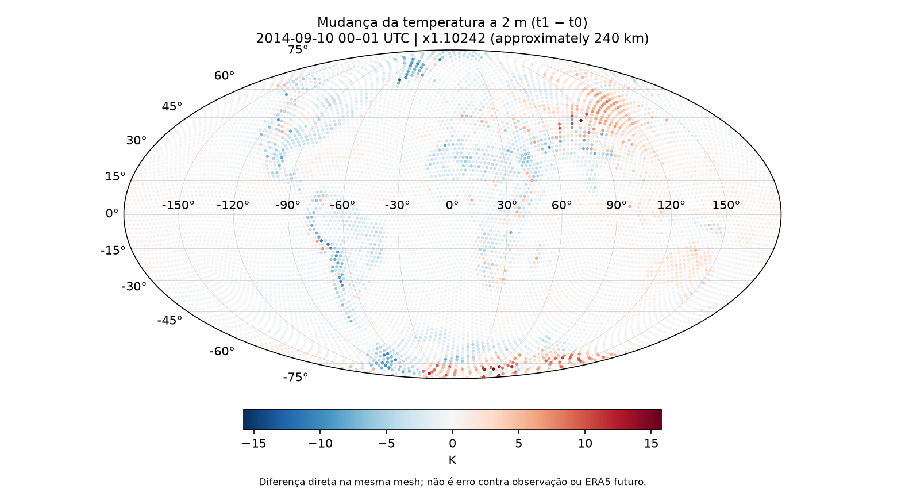
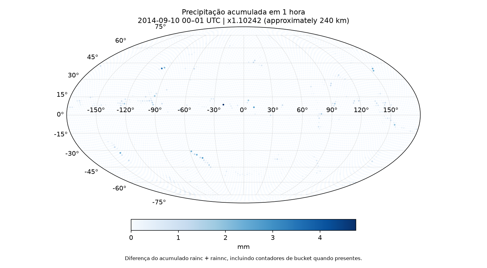

# MPAS-ERA5

Pipeline reproduzível, auditável e didático para transformar dados ERA5 em
uma simulação global do MPAS-Atmosphere. O projeto cobre a stack científica,
aquisição e pré-processamento dos dados, condições iniciais, execução MPI,
validação em camadas e visualização — sem versionar os gigabytes de dados
científicos.

> `PROJECT_BASE_STATUS = COMPLETE`
>
> O escopo técnico original foi concluído. Isso não significa que o modelo
> seja meteorologicamente perfeito: `forecast_skill=NOT_EVALUATED` e
> `spinup=INSUFFICIENT_TEMPORAL_WINDOW`.

## Resultado

A baseline reproduzida usa MPAS-Model 8.4.1 na mesh global x1.10242
(10.242 células, ~240 km), inicializada pelo ERA5 de
2014-09-10 00 UTC. O `atmosphere_model` avançou uma hora com `dt=1200 s`
em quatro ranks MPI e produziu history/diagnostics em 00 e 01 UTC.

| Resultado | Estado |
|---|---|
| Pipeline ERA5 → WPS → MPAS init → atmosphere | PASS |
| Execução de 1 h / 4 ranks / 0 errors / 0 critical | PASS |
| Integridade e estabilidade numérica | PASS |
| Sanity científico da primeira hora | PASS |
| Skill contra análise/observação futura | NOT_EVALUATED |
| Spin-up | INSUFFICIENT_TEMPORAL_WINDOW |

O relatório técnico completo está em
[`docs/project/completion-report.md`](docs/project/completion-report.md).

## Resultados visuais

| Temperatura a 2 m em 01 UTC | Variação de T2m em 1 h |
|---|---|
|  |  |
| x1.10242 (~240 km), 2014-09-10 01 UTC, após 1 h | x1.10242 (~240 km), 00→01 UTC |



*Precipitação acumulada entre 00 e 01 UTC na mesh x1.10242 (~240 km). As
figuras demonstram o pipeline e o sanity do output; não demonstram forecast
skill.*

## Arquitetura

```text
CDS ERA5 → GRIB → WPS/ungrib → WPS intermediate
                                      ↓
WPS_GEOG + x1.10242 → static.nc ─→ init_atmosphere → init.nc
                                                        ↓
                                             atmosphere_model
                                                        ↓
                                                history / diag
                                                        ↓
                                             analysis container
                                                        ↓
                                                sanity + figures
```

Três responsabilidades ficam isoladas:

- `scientific`: GNU/OpenMPI, bibliotecas, WPS e MPAS;
- `acquisition`: Python/CDSAPI e credencial montada somente em runtime;
- `analysis`: NumPy/xarray/netCDF4/Matplotlib, offline e read-only.

O mapa de navegação e o pipeline detalhado estão em
[`docs/architecture/project-graph.md`](docs/architecture/project-graph.md).

## Tecnologias

Docker, Linux, GCC/GFortran, OpenMPI/MPI-IO, zlib, HDF5, netCDF-C,
netCDF-Fortran, PnetCDF, PIO2, METIS, WPS, MPAS-Atmosphere, ERA5/CDS,
Python, xarray, NumPy e Matplotlib.

Versões principais congeladas: zlib 1.3.2, HDF5 1.14.6, netCDF-C 4.10.1,
netCDF-Fortran 4.6.3, PnetCDF 1.15.0, PIO 2.7.0, METIS 5.1.0,
WPS 4.7.0 e MPAS-Model 8.4.1.

## Pipeline reproduzido

1. construir a imagem científica;
2. adquirir e particionar a mesh x1.10242;
3. adquirir seletivamente WPS_GEOG e gerar `static.nc`;
4. adquirir ERA5 global em pressure/single levels;
5. converter GRIB com a `Vtable.ECMWF` upstream;
6. gerar `init.nc` em quatro ranks;
7. executar a primeira hora do MPAS em quatro ranks;
8. validar funcional, numérica e cientificamente;
9. produzir summary, tabela diagnóstica e figuras.

O guia operacional para quem acabou de clonar o repositório está em
[`docs/reproducibility/end-to-end.md`](docs/reproducibility/end-to-end.md).

## Validar um estado já materializado

Com as imagens e os artefatos canônicos locais presentes:

```sh
./scripts/validate/final-project.sh
```

Esse comando não baixa dados, não regenera static/init e não executa uma nova
previsão. Ele valida a instalação e os artefatos existentes; se faltar uma
entrada, informa os comandos explícitos de reprodução.

Saída final esperada:

```text
environment=PASS
scientific_stack=PASS
mesh=PASS
static=PASS
era5_raw=PASS
wps_intermediate=PASS
initial_conditions=PASS
atmosphere_integration=PASS
scientific_sanity=PASS
forecast_skill=NOT_EVALUATED
spinup=INSUFFICIENT_TEMPORAL_WINDOW
PROJECT_BASE_STATUS=COMPLETE
project_validation=PASS
```

## Validação científica

A análise varreu 47.603.258 valores numéricos sem NaN/Inf. Pressão,
densidade, temperatura e espessura vertical permaneceram positivas; o estado
prognóstico evoluiu; a precipitação acumulada permaneceu finita, não negativa
e não decrescente.

Dois resultados são deliberadamente `REPORT-ONLY`:

- massa de ar seco: variação relativa de aproximadamente `-1,6e-11`, sem
  threshold retrospectivo;
- 11 valores de `q2 < 0`, mínimo `-4,7118e-4 kg kg⁻¹`, localizados na
  Antártica e documentados no caminho da surface layer sem clamp.

Método, métricas e limites:
[`docs/validation/first-atmosphere-run.md`](docs/validation/first-atmosphere-run.md).

## Documentação

- [índice técnico e Obsidian](docs/README.md);
- [guia end-to-end](docs/reproducibility/end-to-end.md);
- [relatório técnico final](docs/project/completion-report.md);
- [primeiro caso global](docs/cases/first-global-240km.md);
- [matriz de validação](docs/testing/validation-matrix.md);
- [requisitos e rastreabilidade](docs/project/requirements.md);
- [fontes e versões](docs/references/source-registry.md);
- [ADRs](docs/decisions/README.md);
- [material didático](learning/README.md);
- [material para portfólio/LinkedIn](docs/portfolio/project-showcase.md).

## Estrutura

| Pasta | Responsabilidade | Versionado | Local/ignorado |
|---|---|---|---|
| `cases/` | configurações científicas e requests aprovadas | namelists, streams e JSON | nenhum output |
| `docker/` | imagens científica, aquisição e análise | Dockerfiles e locks | imagens/cache Docker |
| `docs/` | arquitetura, operação, evidência e decisões | Markdown, summary e figuras selecionadas | logs volumosos |
| `learning/` | explicações por ciclo e conceitos transferíveis | notas didáticas | — |
| `scripts/` | aquisição, preparação, execução, análise e validação | código e contratos | workspaces temporários |
| `tests/` | fixtures e smokes de interfaces instaladas | fontes pequenas | executáveis/outputs temporários |
| `data/` | entradas e saídas científicas materializadas | apenas `.gitkeep` quando aplicável | mesh, WPS_GEOG, GRIB, NetCDF, logs e manifestos |

O grafo do projeto é a referência principal para saber onde procurar cada
informação.

## Principais aprendizados

- reproduzir uma stack HPC exige versões, fontes, checksums e testes de
  interface instalada, não apenas um Dockerfile;
- MPI-IO precisa ser diagnosticado por backend: o projeto distinguiu OMPIO e
  ROMIO sem trocar a implementação MPI;
- dados geográficos e meteorológicos devem ser validados contra o consumidor
  real, não apenas contra nomes de arquivos;
- correção de software, sanity numérico e skill meteorológico são perguntas
  diferentes;
- dados científicos grandes pertencem a armazenamento local reproduzível,
  enquanto configuração, proveniência e evidência pequena pertencem ao Git.

## Limitações e extensões

A baseline tem somente uma hora, quatro ranks, mesh grossa, SST fixa e Noah.
Ela não mede skill, spin-up, escalabilidade, performance ou estabilidade
multidiária. Esses itens são extensões, não requisitos faltantes do projeto
base. O backlog está em
[`docs/project/future-experiments.md`](docs/project/future-experiments.md).

## Referências

As origens oficiais de MPAS, WPS, ERA5/CDS, bibliotecas, imagens-base,
artefatos e checksums estão classificadas no
[`source registry`](docs/references/source-registry.md); a baseline congelada
está no [`versions.lock.md`](docs/references/versions.lock.md).
